# DATABASE-SCHEMA

# PROJECT DATABASE SCHEMA

> **Status:** Draft v0.1 — conceptual/logical domain schema for review.
>
> **Important:** This is not a migration-ready specification yet. No Laravel
> migrations should be created until the requirements, schema, relationships,
> and open decisions are approved.

## 1. Purpose & Scope

This document defines the proposed domain schema for the **AI Innovation Lifecycle
Hub** built from Laravel Master Starter.

The schema extends the inherited starter foundation rather than duplicating
authentication, RBAC, notifications, settings, media, audit logs, or API infrastructure.

## 2. Database Design Principles

- Normalize data that must be queried/reported.
- Use foreign keys and explicit delete behavior.
- Use many-to-many join tables where appropriate.
- Use JSON only for intentionally flexible/configurable structures.
- Keep PostgreSQL and SQLite compatibility.
- Avoid PostgreSQL-only SQL/data types without an approved compatibility strategy.
- Keep high-impact workflow decisions auditable.
- Reuse `users`, `media`, `activity_logs`, and `notifications` from the Master Starter.
- Do not create a second RBAC or notification system.
- Do not build the whole future ecosystem into v1.

## 3. Inherited Master Starter Core

The following already exist and must be reused:

- `users`
- `roles`
- `permissions`
- `role_has_permissions`
- `model_has_roles`
- `model_has_permissions`
- `notifications`
- `activity_logs`
- `settings`
- `media`
- `import_runs`
- `personal_access_tokens`
- `sessions`
- Laravel cache/queue infrastructure tables

## 4. Domain Architecture Overview

```text
Program
 ├── Stages
 ├── Eligibility Rules
 ├── Rubrics
 ├── Judges
 ├── Events
 ├── Partners
 └── Applications
       ├── Applicant / Team
       ├── Submissions
       ├── Evidence / Media
       ├── Screening
       ├── Evaluations
       │     ├── Criterion Scores
       │     └── AI Assistance
       ├── Deliberation
       └── Selection Decision

Selected Application
 ├── Incubation
 │    ├── Mentors
 │    ├── Goals
 │    ├── Milestones
 │    ├── Sessions
 │    └── Progress
 ├── Resource Allocations
 └── Showcase / Follow-up
```

## 5. Entity Inventory

### Program

- `programs`
- `program_stages`
- `program_eligibility_rules`
- `program_rubrics`
- `evaluation_criteria`

### Applicant

- `participant_profiles`
- `teams`
- `team_members`
- `applications`
- `application_submissions`
- `application_questions`
- `application_answers`
- `application_media`

### Screening / Judging

- `application_screenings`
- `application_screening_results`
- `judge_profiles`
- `judge_assignments`
- `conflict_declarations`
- `judge_evaluations`
- `evaluation_scores`

### AI

- `ai_interactions`
- `ai_sources`
- `ai_review_actions`

### Decision / Events

- `program_events`
- `event_participants`
- `deliberation_sessions`
- `deliberation_participants`
- `deliberation_items`
- `selection_decisions`

### Incubation / Mentorship

- `incubation_enrollments`
- `mentor_profiles`
- `mentor_assignments`
- `mentorship_goals`
- `mentorship_sessions`
- `milestones`
- `milestone_updates`

### Resources / Partners / Follow-up

- `resources`
- `resource_allocations`
- `organizations`
- `organization_contacts`
- `program_partners`
- `partner_contributions`
- `alumni_records`
- `follow_up_updates`

## 6. Program & Challenge Domain

### `programs`

Purpose: one configurable innovation program/challenge.

Core columns:

- `id`
- `name`
- `code`
- `slug`
- `description`
- `objective`
- `status`
- `application_opens_at`
- `application_closes_at`
- `timezone`
- `capacity` nullable
- `published_at` nullable
- `archived_at` nullable
- `created_by` → `users.id`
- timestamps

Relationships:

- hasMany stages
- hasMany eligibility rules
- hasMany rubrics
- hasMany applications
- hasMany events
- hasMany judge assignments
- belongsToMany organizations through program partners

Constraints:

- unique `code`
- unique `slug`

### `program_stages`

Purpose: ordered configurable workflow stage.

Core columns:

- `id`
- `program_id`
- `code`
- `name`
- `description`
- `sequence`
- `status`
- `starts_at` nullable
- `ends_at` nullable
- `configuration` JSON nullable
- timestamps

Constraints:

- unique `(program_id, code)`
- unique `(program_id, sequence)`

### `program_eligibility_rules`

Purpose: configurable eligibility/screening requirement.

Core columns:

- `id`
- `program_id`
- `code`
- `name`
- `description`
- `rule_type`
- `configuration` JSON
- `is_required`
- `sequence`
- timestamps

## 7. Applicant & Team Domain

### `participant_profiles`

Purpose: domain profile for a user participating as an innovator/applicant.

Core columns:

- `id`
- `user_id` unique FK
- `bio` nullable
- `location` nullable
- `education_summary` nullable
- `experience_summary` nullable
- `skills` JSON nullable
- `technical_expertise` JSON nullable
- `links` JSON nullable
- timestamps

Do not duplicate authentication identity fields from `users`.

### `teams`

Purpose: domain team able to submit an application.

Core columns:

- `id`
- `name`
- `description` nullable
- `status`
- `created_by` → users
- timestamps

### `team_members`

Purpose: user/team membership.

Core columns:

- `id`
- `team_id`
- `user_id`
- `membership_role`
- `is_lead`
- `status`
- `joined_at`
- `left_at` nullable
- timestamps

Important constraint: a user should not have duplicate active membership in the same team.

## 8. Application & Submission Domain

### `applications`

Purpose: main applicant submission container.

Core columns:

- `id`
- `program_id`
- `reference` unique
- `lead_user_id`
- `team_id` nullable
- `title`
- `status`
- `current_stage_id`
- `submitted_at` nullable
- `withdrawn_at` nullable
- `withdrawal_reason` nullable
- timestamps

Relationships:

- belongsTo Program
- belongsTo User as lead applicant
- belongsTo Team nullable
- hasMany Submissions
- hasMany Screening records
- hasMany Evaluations
- hasOne Selection Decision
- may haveOne Incubation Enrollment

### Configurable application questions

#### `application_questions`

- `id`
- `program_id`
- `code`
- `label`
- `description`
- `field_type`
- `configuration` JSON nullable
- `required`
- `sequence`
- timestamps

#### `application_answers`

- `id`
- `application_id`
- `question_id`
- `value_text` nullable
- `value_json` nullable
- timestamps

Open decision: whether v1 needs a full configurable form engine or a smaller fixed set of application columns.

### `application_submissions`

Purpose: preserve meaningful submission/revision history.

Core columns:

- `id`
- `application_id`
- `version`
- `submitted_by`
- `submitted_at`
- `submission_type`
- `snapshot` JSON nullable
- `status`
- timestamps

Open decision: true immutable snapshots vs lighter revision history.

### `application_media`

Purpose: explicit domain relation to inherited `media`.

Core columns:

- `id`
- `application_id`
- `media_id`
- `purpose`
- `submission_id` nullable
- timestamps

## 9. Eligibility & Screening Domain

### `application_screenings`

- `id`
- `application_id`
- `stage_id`
- `reviewer_id`
- `status`
- `decision`
- `score` nullable
- `reason` nullable
- `completed_at` nullable
- timestamps

### `application_screening_results`

Recommended when rule-level traceability is needed:

- `id`
- `screening_id`
- `eligibility_rule_id`
- `result`
- `notes` nullable
- `evidence_reference` nullable
- timestamps

## 10. Evaluation & Rubric Domain

### `program_rubrics`

Purpose: versioned program evaluation framework.

- `id`
- `program_id`
- `name`
- `version`
- `stage_id` nullable
- `status`
- `effective_from` nullable
- `effective_to` nullable
- timestamps

Constraint: unique `(program_id, version)`.

### `evaluation_criteria`

- `id`
- `rubric_id`
- `code`
- `name`
- `description`
- `weight`
- `minimum_score`
- `maximum_score`
- `guidance` nullable
- `sequence`
- timestamps

Constraint: unique `(rubric_id, code)`.

Rubric versions should become immutable once judging has started.

## 11. Judge & Conflict-of-Interest Domain

### `judge_profiles`

- `id`
- `user_id` unique
- `bio` nullable
- `organization` nullable
- `expertise` JSON nullable
- `specialization` JSON nullable
- `availability_status`
- timestamps

### `judge_assignments`

- `id`
- `program_id`
- `stage_id` nullable
- `application_id` nullable
- `judge_user_id`
- `assignment_status`
- `assigned_at`
- `removed_at` nullable
- timestamps

Open decision: program-level assignment vs materialized application-level assignments.

### `conflict_declarations`

- `id`
- `judge_user_id`
- `program_id`
- `application_id` nullable
- `team_id` nullable
- `organization_id` nullable
- `conflict_type`
- `description`
- `status`
- `declared_at`
- `reviewed_by` nullable
- `reviewed_at` nullable
- `resolution` nullable
- `resolution_reason` nullable
- timestamps

## 12. AI Assistance & Evidence Domain

### `ai_interactions`

Purpose: provider/model-neutral audit of an AI-assisted operation.

- `id`
- `requested_by`
- `task_type`
- `provider`
- `model`
- `prompt_version` nullable
- `target_type`
- `target_id`
- `status`
- `input_summary` nullable
- `output_text` nullable
- `metadata` JSON nullable
- `created_at`
- `completed_at` nullable

Never store API keys or credentials.

### `ai_sources`

Purpose: source/evidence references used by an AI interaction.

- `id`
- `ai_interaction_id`
- `source_type`
- `source_id`
- `source_label`
- `excerpt` nullable
- `metadata` JSON nullable
- timestamps

### `ai_review_actions`

Purpose: human review/disposition of AI output.

- `id`
- `ai_interaction_id`
- `reviewer_id`
- `action`
- `edited_output` nullable
- `review_comment` nullable
- `reviewed_at`
- timestamps

Actions: accepted, modified, rejected, not_used.

## 13. Pitch, Deliberation & Decision Domain

### `program_events`

- `id`
- `program_id`
- `stage_id` nullable
- `event_type`
- `name`
- `description` nullable
- `starts_at`
- `ends_at`
- `location` nullable
- `online_url` nullable
- `capacity` nullable
- `status`
- timestamps

### `event_participants`

- `id`
- `event_id`
- `user_id`
- `application_id` nullable
- `participant_role`
- `attendance_status`
- `notes` nullable
- timestamps

### `deliberation_sessions`

- `id`
- `program_id`
- `stage_id`
- `name`
- `status`
- `scheduled_at` nullable
- `final_decision_at` nullable
- `decision_summary` nullable
- timestamps

### `deliberation_participants`

- `id`
- `deliberation_session_id`
- `judge_user_id`
- `participation_role`
- timestamps

### `deliberation_items`

- `id`
- `deliberation_session_id`
- `application_id`
- `discussion_summary` nullable
- `recommendation` nullable
- `decision` nullable
- `decision_reason` nullable
- timestamps

### `selection_decisions`

- `id`
- `application_id`
- `program_stage_id`
- `decision`
- `reason` nullable
- `decided_by`
- `decided_at`
- `is_final`
- timestamps

Selection is a formal human outcome, not a computed score field.

## 14. Mentorship & Incubation Domain

### `mentor_profiles`

- `id`
- `user_id` unique
- `bio` nullable
- `expertise` JSON nullable
- `specialization` JSON nullable
- `availability_status`
- timestamps

### `incubation_enrollments`

- `id`
- `program_id`
- `application_id`
- `status`
- `phase` nullable
- `starts_at` nullable
- `ends_at` nullable
- `assigned_staff_id` nullable
- `objectives` JSON nullable
- `outcomes` JSON nullable
- timestamps

### `mentor_assignments`

- `id`
- `incubation_enrollment_id`
- `mentor_user_id`
- `assigned_at`
- `ended_at` nullable
- `status`
- timestamps

### `mentorship_goals`

- `id`
- `mentor_assignment_id`
- `title`
- `description` nullable
- `target_date` nullable
- `status`
- `completed_at` nullable
- timestamps

### `mentorship_sessions`

- `id`
- `mentor_assignment_id`
- `scheduled_at`
- `duration_minutes` nullable
- `summary` nullable
- `outcomes` nullable
- `action_items` JSON nullable
- `status`
- timestamps

## 15. Milestones & Progress Domain

### `milestones`

- `id`
- `incubation_enrollment_id`
- `title`
- `description` nullable
- `sequence`
- `due_at` nullable
- `status`
- `completion_percent`
- `completed_at` nullable
- timestamps

### `milestone_updates`

- `id`
- `milestone_id`
- `updated_by`
- `status`
- `progress_percent`
- `comment` nullable
- `evidence_media_id` nullable
- timestamps

## 16. Events, Training & Showcase Domain

`program_events` may cover pitches, training, workshops, demonstrations,
showcases, and awards.

Use `event_type` and participant roles rather than building separate calendars
for every event category.

Open decision: whether v1 needs full calendar/recurrence support.

## 17. Resources & Workspace Domain

### `resources`

- `id`
- `name`
- `resource_type`
- `description` nullable
- `identifier` nullable
- `capacity` nullable
- `status`
- `metadata` JSON nullable
- timestamps

### `resource_allocations`

- `id`
- `resource_id`
- `program_id` nullable
- `application_id` nullable
- `team_id` nullable
- `user_id` nullable
- `starts_at`
- `ends_at` nullable
- `status`
- `notes` nullable
- timestamps

Overlap rules must be validated at the application/service level and, where possible,
with database constraints/indexes appropriate for both supported engines.

## 18. Partners, Vendors & Stakeholders Domain

### `organizations`

- `id`
- `name`
- `organization_type`
- `description` nullable
- `website` nullable
- `location` nullable
- `status`
- timestamps

### `organization_contacts`

- `id`
- `organization_id`
- `user_id` nullable
- `name`
- `email` nullable
- `phone` nullable
- `position` nullable
- `is_primary`
- timestamps

### `program_partners`

- `id`
- `program_id`
- `organization_id`
- `relationship_type`
- `status`
- `starts_at` nullable
- `ends_at` nullable
- `notes` nullable
- timestamps

### `partner_contributions`

- `id`
- `program_partner_id`
- `contribution_type`
- `description`
- `value` nullable
- `status`
- `starts_at` nullable
- `ends_at` nullable
- timestamps

## 19. Communications Domain

Reuse inherited `notifications` for system/user notifications.

No separate notification table is proposed.

Domain entities may later be added for announcements or message threads only if
requirements prove they are necessary.

## 20. Post-Program / Alumni Domain

### `alumni_records`

- `id`
- `application_id`
- `status`
- `joined_at`
- `notes` nullable
- timestamps

### `follow_up_updates`

- `id`
- `alumni_record_id`
- `reported_by`
- `report_type`
- `content`
- `outcome` nullable
- `reported_at`
- timestamps

Keep this intentionally lightweight for v1.

## 21. Cross-Cutting Audit & Notifications

Reuse inherited:

- `activity_logs`
- `notifications`

Potential audit events:

- `applications.submitted`
- `screening.completed`
- `judges.assigned`
- `conflicts.declared`
- `conflicts.resolved`
- `evaluations.finalized`
- `deliberations.completed`
- `selections.decided`
- `mentors.assigned`
- `milestones.updated`
- `resources.allocated`
- `ai.reviewed`

## 22. Core Table Definitions

No new core Master Starter tables are proposed.

Downstream domain tables must reference the inherited core through foreign keys,
not duplicate identity/authentication/notification/storage infrastructure.

## 23. Domain Table Definitions

For each proposed table, migration design must document:

- primary key
- columns and types
- nullability
- defaults
- foreign keys
- indexes
- unique constraints
- relationships
- delete behavior
- audit implications
- status/state behavior

The detailed table-by-table definitions above are the current logical proposal;
exact SQL/migration types require final review.

## 24. Primary Keys, Foreign Keys & Delete Rules

Recommended principles:

- user profile references are generally restricted or nullable rather than destructive
- audit actors are nullable so history survives user deletion
- historical evaluations/decisions should survive display-profile changes
- media follows inherited Master Starter behavior
- relation rows may cascade only when meaningless without their parents
- avoid cascading deletion of consequential program/application history

Exact delete rules are an approval item before migrations.

## 25. Unique Constraints

Likely constraints include:

- program code
- program slug
- participant profile per user
- active team membership per team/user
- application reference
- rubric version per program
- criterion code per rubric
- score per evaluation/criterion
- mentor profile per user
- judge profile per user
- organization partner relation per program/organization/type where appropriate

Exact uniqueness must be validated against workflow requirements.

## 26. Indexing Strategy

Index all foreign keys plus high-frequency filters such as:

- program status
- stage sequence/status
- application program/status/stage/submitted time
- judge assignment
- conflict status
- evaluation judge/application/stage
- AI target/task/created time
- event start time
- incubation status
- milestone due/status
- resource allocation dates
- partner program

Final indexes should be guided by expected query volume.

## 27. Status / State Model

Avoid one global lifecycle enum.

Use scoped statuses for:

- programs
- stages
- applications
- screenings
- judge assignments
- conflicts
- evaluations
- deliberations
- decisions
- incubation
- milestones
- resources
- events

Where workflow is configurable, transition rules should live in domain logic/configuration.

## 28. Polymorphic Relationships

Allowed/recommended polymorphic concepts:

- inherited `activity_logs.subject`
- inherited `media.attachable`
- AI source/target references where multiple domain types genuinely require them

Do not use polymorphism merely to avoid designing normal foreign keys.

## 29. Flexible / JSON Fields

Good candidates:

- application question configuration
- configurable rule configuration
- flexible application answers
- AI metadata
- evidence metadata
- organization/resource metadata
- structured action items/outcomes where schema is intentionally flexible

Do not put query-critical IDs, statuses, scores, dates, or permissions in JSON.

## 30. Security & Authorization Considerations

Domain permissions should follow the Master Starter convention:

`resource.action`

Potential examples (not yet approved):

- programs.view/create/update/publish
- applications.view/create/update/screen
- evaluations.view/score/manage
- conflicts.view/resolve
- selections.manage
- mentorship.manage
- resources.manage

These must be added to the project's RBAC seeder after product decisions are approved.

Never bypass route permissions, FormRequest authorization, or policies.

## 31. PostgreSQL + SQLite Compatibility

The schema must be compatible with both supported engines.

Avoid:

- PostgreSQL-only column types without a clear portable strategy
- PostgreSQL-only SQL in migrations or shared business queries
- JSON operators that lack a SQLite-safe path
- assumptions based on PostgreSQL-only constraint behavior

Both database paths must be migrated and tested after implementation.

## 32. Seed Data Requirements

The inherited Master Starter seeders remain authoritative for core data.

Project seeders may eventually provide controlled development/demo data such as:

- example program
- sample stages
- example rubric
- test judge
- test applicant/team
- example resource

No fabricated production-looking personal data should be committed as if real.

## 33. Migration Ordering / Dependency Order

Initial dependency order:

1. organizations
2. participant profiles
3. teams / team members
4. programs
5. program stages
6. eligibility rules
7. application questions
8. applications
9. submissions
10. application media
11. rubrics / criteria
12. judge profiles
13. judge assignments
14. conflict declarations
15. screenings
16. evaluations
17. scores
18. AI interactions / sources / review actions
19. events
20. deliberations
21. selection decisions
22. mentors / mentorship
23. incubation
24. milestones
25. resources / allocations
26. program partners / contributions
27. alumni / follow-up

This order is provisional until open questions are resolved.

## 34. Relationship Summary

```text
User
 ├── participant_profile
 ├── judge_profile
 ├── mentor_profile
 ├── teams
 ├── applications
 ├── evaluations
 ├── activity_logs
 └── notifications

Program
 ├── stages
 ├── eligibility_rules
 ├── rubrics
 ├── applications
 ├── judges/assignments
 ├── events
 └── partners

Application
 ├── lead user
 ├── team
 ├── submissions
 ├── media
 ├── screenings
 ├── evaluations
 ├── deliberation items
 ├── selection decision
 └── incubation enrollment

Evaluation
 ├── judge
 ├── application
 ├── rubric
 └── scores

Score
 └── criterion

AI Interaction
 ├── requester
 ├── target
 ├── sources
 └── review actions

Incubation
 ├── application
 ├── mentors
 ├── goals
 ├── milestones
 └── resources
```

## 35. Entity Relationship Diagram (Mermaid)

```mermaid
erDiagram
    USERS ||--o| PARTICIPANT_PROFILES : has
    USERS ||--o| JUDGE_PROFILES : has
    USERS ||--o| MENTOR_PROFILES : has
    USERS ||--o{ TEAM_MEMBERS : joins
    TEAMS ||--o{ TEAM_MEMBERS : contains

    PROGRAMS ||--o{ PROGRAM_STAGES : has
    PROGRAMS ||--o{ PROGRAM_ELIGIBILITY_RULES : defines
    PROGRAMS ||--o{ PROGRAM_RUBRICS : uses
    PROGRAMS ||--o{ APPLICATIONS : receives
    PROGRAMS ||--o{ PROGRAM_EVENTS : hosts

    USERS ||--o{ APPLICATIONS : leads
    TEAMS ||--o{ APPLICATIONS : submits
    APPLICATIONS ||--o{ APPLICATION_SUBMISSIONS : versions
    APPLICATIONS ||--o{ APPLICATION_MEDIA : includes
    MEDIA ||--o{ APPLICATION_MEDIA : attached

    APPLICATIONS ||--o{ APPLICATION_SCREENINGS : screened
    PROGRAM_ELIGIBILITY_RULES ||--o{ APPLICATION_SCREENING_RESULTS : evaluates
    APPLICATION_SCREENINGS ||--o{ APPLICATION_SCREENING_RESULTS : contains

    PROGRAM_RUBRICS ||--o{ EVALUATION_CRITERIA : contains
    JUDGE_PROFILES ||--o{ JUDGE_ASSIGNMENTS : receives
    APPLICATIONS ||--o{ JUDGE_ASSIGNMENTS : assigned
    JUDGE_PROFILES ||--o{ CONFLICT_DECLARATIONS : declares
    APPLICATIONS ||--o{ CONFLICT_DECLARATIONS : affected

    JUDGE_PROFILES ||--o{ JUDGE_EVALUATIONS : performs
    APPLICATIONS ||--o{ JUDGE_EVALUATIONS : receives
    PROGRAM_RUBRICS ||--o{ JUDGE_EVALUATIONS : governs
    JUDGE_EVALUATIONS ||--o{ EVALUATION_SCORES : contains
    EVALUATION_CRITERIA ||--o{ EVALUATION_SCORES : scored

    AI_INTERACTIONS ||--o{ AI_SOURCES : cites
    AI_INTERACTIONS ||--o{ AI_REVIEW_ACTIONS : reviewed

    DELIBERATION_SESSIONS ||--o{ DELIBERATION_PARTICIPANTS : includes
    DELIBERATION_SESSIONS ||--o{ DELIBERATION_ITEMS : discusses
    APPLICATIONS ||--o{ DELIBERATION_ITEMS : discussed
    APPLICATIONS ||--o| SELECTION_DECISIONS : receives

    APPLICATIONS ||--o| INCUBATION_ENROLLMENTS : enters
    INCUBATION_ENROLLMENTS ||--o{ MENTOR_ASSIGNMENTS : has
    MENTOR_PROFILES ||--o{ MENTOR_ASSIGNMENTS : receives
    MENTOR_ASSIGNMENTS ||--o{ MENTORSHIP_GOALS : defines
    MENTOR_ASSIGNMENTS ||--o{ MENTORSHIP_SESSIONS : holds

    INCUBATION_ENROLLMENTS ||--o{ MILESTONES : tracks
    MILESTONES ||--o{ MILESTONE_UPDATES : changes

    RESOURCES ||--o{ RESOURCE_ALLOCATIONS : allocated
    APPLICATIONS ||--o{ RESOURCE_ALLOCATIONS : receives
    TEAMS ||--o{ RESOURCE_ALLOCATIONS : receives

    ORGANIZATIONS ||--o{ ORGANIZATION_CONTACTS : has
    PROGRAMS ||--o{ PROGRAM_PARTNERS : engages
    ORGANIZATIONS ||--o{ PROGRAM_PARTNERS : participates
    PROGRAM_PARTNERS ||--o{ PARTNER_CONTRIBUTIONS : provides
```



## 36. Open Decisions / Questions

The following must be resolved before migrations are considered final:

1. Final product name.
2. Whether organization/startup applications are first-class in v1.
3. Exact configurable-question architecture.
4. Submission versioning model.
5. Judge assignment granularity.
6. Rubric versioning/immutability policy.
7. Judge score visibility rules.
8. Exact conflict-of-interest blocking behavior.
9. AI task permissions by lifecycle stage.
10. AI data retention policy.
11. Whether AI outputs are applicant-visible.
12. Event/calendar depth.
13. Partner portal requirements.
14. Exact incubation phases.
15. Resource allocation rules.
16. Alumni/follow-up depth.
17. Expected scale/volume.
18. Legal/compliance/data-residency requirements.
19. Final domain permission catalog.
20. Exact delete/archival policies.

## 37. Explicit Non-Goals

This schema intentionally does not model:

- CMS
- generic public website engine
- ERP/accounting
- full CRM
- full LMS
- generic project management
- autonomous AI judge
- autonomous winner selection
- Spatie Teams
- department RBAC
- marketplace
- blockchain

## 38. Approval Gate Before Migrations

**NO MIGRATIONS SHOULD BE CREATED YET.**

Required order:

1. Approve `PROJECT-REQUIREMENTS.md`.
2. Review this `DATABASE-SCHEMA.md`.
3. Resolve the open decisions.
4. Create/finalize `PROJECT-ROADMAP.md`.
5. Produce the migration/model implementation plan.
6. Only then create Laravel migrations and models.

The schema is expected to be matured after the implementation agent reviews the
repository and validates constraints against the Master Starter architecture.
